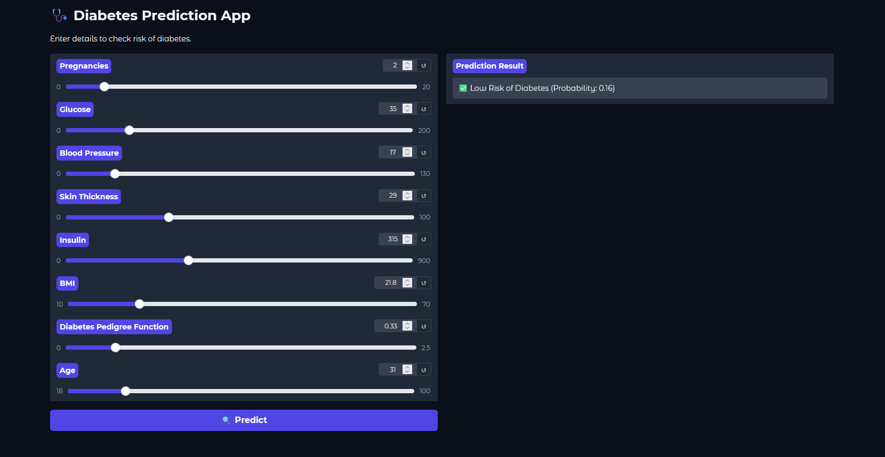

# 🩺 Diabetes Prediction App with XGBoost  

  

## 📌 Project Overview  
This project is a **Machine Learning web application** that predicts the likelihood of diabetes based on user inputs such as glucose levels, BMI, insulin, and age.  

The model is built using **XGBoost Classifier**, trained on the **PIMA Indians Diabetes Dataset**, and deployed using **Gradio** with an interactive UI.  

---

## 🚀 Features  
- **User-friendly Web Interface** powered by Gradio  
- **XGBoost Classifier** with hyperparameter tuning  
- **Pickle model saving** (no need to retrain every time)  
- Displays **Prediction Result & Probability**  
- Deployed as a **live web app**  

---

## 🔗 Live Demo  
👉 [Click here to try the app](https://huggingface.co/spaces/GokulV/diabetes-prediction)  

---

## 📂 Project Structure  
```
📦 Diabetes-Prediction-App
 ┣ 📜 train_model.py        # Script to train and save model
 ┣ 📜 app.py                # Gradio web app
 ┣ 📜 requirements.txt      # Dependencies
 ┣ 📜 README.md             # Documentation
 ┣ 📜 diabetes_model.pkl    # Saved model (generated after training)
 ┣ 📜 scaler.pkl            # Saved scaler
 ┗ 📂 images
     ┣ 📜 output.png        # Sample output image
     ┗ 📜 webapp.png        # Gradio UI screenshot
```

---

## ⚙️ Installation & Usage  

### 1️⃣ Clone the Repository  
```bash
git clone https://github.com/your-username/diabetes-prediction-app.git
cd diabetes-prediction-app
```

### 2️⃣ Install Dependencies  
```bash
pip install -r requirements.txt
```

### 3️⃣ Train & Save Model  
```bash
python train_model.py
```

### 4️⃣ Run Web App  
```bash
python app.py
```

The app will start at **http://127.0.0.1:7860/**  

---

## 🖼️ Screenshots  

### 🔹 Gradio Web App UI  
  

---

## 📊 Model Performance  
- **Accuracy:** ~74%  
- **Precision:** ~64%  
- **Recall:** ~50%  
- **ROC-AUC:** ~0.81  

---

## ✅ Conclusion  
This project demonstrates how **Machine Learning + Gradio** can be used to build an interactive health diagnostic tool.  

While the app shows promising results, real-world deployment would require:  
- Larger & more diverse datasets  
- Clinical validation  
- Integration with healthcare systems  

---

## 👨‍💻 Author  
Developed by **[Your Name]** ✨  
